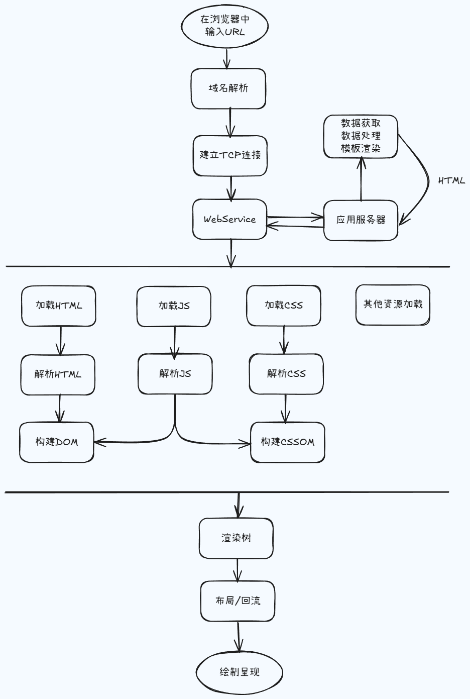
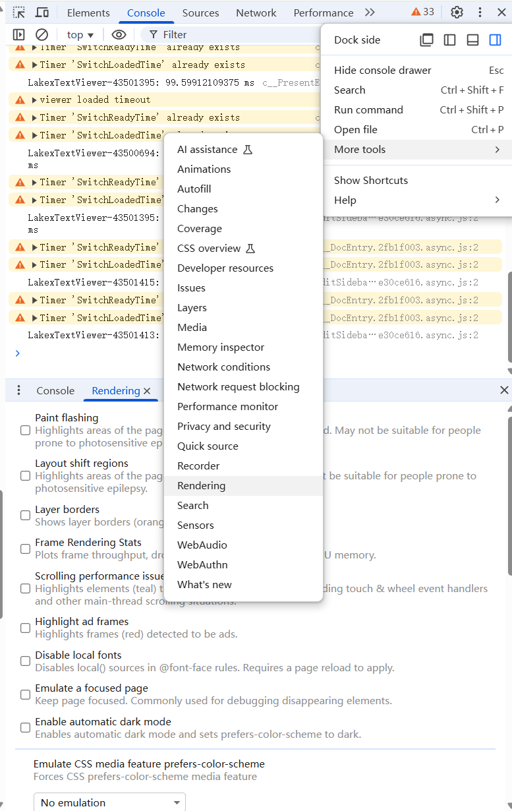

[toc]

---

# Web Performance

## [什么是 Web 性能？](https://developer.mozilla.org/zh-CN/docs/Learn_web_development/Extensions/Performance/What_is_web_performance)

Web 性能是对网站或应用程序的客观度量和用户的体验。这包括以下主要方面：

- **减少总体负载时间：** 需要多长时间才能将渲染网站所需的文件下载到用户的计算机上？这往往受到延迟、文件大小、文件数量以及其他因素的影响。一般策略是使文件尽可能小，尽可能减少 HTTP 请求的次数，并采用巧妙的加载技术（例如 [preload](https://developer.mozilla.org/zh-CN/docs/Web/HTML/Reference/Attributes/rel/preload)）使文件更快可用。

  > 减小文件体积、减少 HTTP 请求、使用预加载

- **尽快使网站可用：** 简单来说就是以合理的顺序加载你的网站资源，以便用户能够更快地开始使用。在用户继续执行主要任务的同时，任何其他资源都可以在后台继续加载。有时我们也会在实际需要时才加载资源（这被称为懒加载）。网站从开始加载，到达到可用状态为止所需的时间被称为[交互等待时间](https://developer.mozilla.org/zh-CN/docs/Glossary/Time_to_interactive)。

  > 仅加载首屏内容，其它内容根据需要进行懒加载

- **流畅性和交互性：** 应用程序是否可靠，使用起来是否愉快？滚动是否流畅？按钮是否可点击？弹出窗口是否能够快速打开，并且在打开时动画是否流畅？在制作流畅的应用程序时，有很多优秀实践可以参考。例如使用 CSS 动画而不是 JavaScript 来制作动画，并尽量减少由于 DOM 变化而引起重绘 UI 的次数。

  > 使用 CSS 替代 JS 动画、减少 UI 重绘

- **感知性能：** 用户所体验到的，是网站看起来有多快，而不是网站实际有多快。用户感受到的性能与任何客观统计数据一样重要，甚至可能更重要。但这种主观的感受不容易测量。感知性能是用户的感受，而不是度量标准。即使操作将花费很长时间（因为延迟或其他原因），也可以通过显示“加载中”的旋转指示器或一系列有用的提示和技巧（或笑话，以及其他你认为合适的内容）来保持用户在等待期间的参与度。这种方法比什么都不显示要好得多。因为什么都不显示会让用户觉得等待了更长的时间，可能会让你的用户认为网站坏了，然后放弃使用。

  > 你的页面可能不能做得更快，但你可以让用户感觉更快。耗时操作要给用户反馈，比如加载动画、进度条、骨架屏等提示信息

- **性能测量：** Web 性能包括测量应用程序的实际速度和感知速度，在可能的情况下进行优化，然后监视性能，以确保已经优化过的内容保持优化状态。这涉及到许多度量标准（可以指示成功或失败的可度量指标）和测量这些度量标准的工具，我们将在本节中讨论这些度量标准。
  > 性能指标、性能测试、性能监控持续优化

总而言之，许多特性都会影响性能。包括延迟、应用程序大小、DOM 节点数量、资源请求数量、JavaScript 性能、CPU 负载等等。重要的是尽量缩短加载和响应时间，并通过增加额外的功能来隐藏延迟：先使网站变得可以交互，同时在后台加载用户体验中的次要部分。

> 备注： Web 性能既包括客观测量，如加载时间、每秒帧数和交互等待时间，也包括主观体验，如内容加载所需的时间。

## 为什么要关注 Web 性能

- 用户的留存
- 网站的转化率
- 体验与传播
- 搜索排名
- 客户投诉
- 提升工作绩效
- ...

## 如何进行 Web 性能优化？

1. 首先需要了解性能指标 - 多快才算快？
2. 使用专业的工具可量化地评估出网站或应用的性能表现
3. 然后立足于网站页面响应的生命周期，分析出造成较差性能表现的原因
4. 最后进行技术改造、可行性分析等具体的优化实施
5. 迭代优化

## 性能指标

- [RAIL 性能模型](https://web.dev/articles/rail?hl=zh-cn)
- [基于用户体验的核心指标](https://web.dev/explore/metrics?hl=zh-cn)
- [新一代性能指标：Web Vitals](https://web.dev/articles/vitals?hl=zh-cn)

## 网站页面生命周期

## 内容如何渲染

为了有效地理解 web 性能、背后的问题以及我们上面提到的主要部分，你需要先了解一些关于浏览器如何工作的细节。这包括：

- **浏览器的工作原理。** 当你请求一个 URL 并敲击 Enter 或 Return 按键时，浏览器会找出保存该网站文件的服务器的位置，与之建立连接，并请求文件。请参阅[渲染页面：浏览器的工作原理](https://developer.mozilla.org/zh-CN/docs/Web/Performance/Guides/How_browsers_work)。
- **源顺序。** HTML 索引文件的源顺序会显著影响性能。从索引文件链接到的附加资源的下载通常基于引用的顺序。这是可以调整的，需要进行优化。请注意：一些资源在被解析和执行完成之前，会阻塞其他的下载。
- **关键路径。** 这是从服务器下载文件后，浏览器用来构建 web 文档的过程。浏览器按照明确定义的步骤进行操作，优化关键渲染路径以优先显示与当前用户操作相关的内容，将显著改善内容呈现时间。有关更多信息，请参见[关键渲染路径](https://developer.mozilla.org/zh-CN/docs/Web/Performance/Guides/Critical_rendering_path)。
- **文档对象模型。** 文档对象模型（DOM）是一种树状结构，它将 HTML 的内容和元素表示为节点树。这包括所有的 HTML 属性和节点之间的关系。加载页面后的大量 DOM 操作（例如添加、删除或移动节点）可能会影响性能。因此有必要了解 DOM 的工作原理，以及如何减轻此类问题。有关更多信息，请参见文档对象模型。
- **延迟。** 我们之前简要地提到过延迟。简单来说，延迟是你的网站信息从服务器传输到用户计算机所需的时间。建立 TCP 和 HTTP 连接需要消耗系统资源，并且在网络上来回传输请求和响应字节时不可避免地存在延迟。但是有一些方法可以减少延迟（例如，通过下载更少的文件来减少 HTTP 请求的数量，使用 [CDN](https://developer.mozilla.org/zh-CN/docs/Glossary/CDN) 使你的站点在全球范围内具有更普遍的性能，并使用 HTTP/2 协议提高传输的效率）。你可以在了解延迟上阅读有关此主题的所有内容。

## 细节优化

- [JavaScript 性能优化](https://developer.mozilla.org/zh-CN/docs/Learn_web_development/Extensions/Performance/JavaScript)
- [HTML 性能优化](https://developer.mozilla.org/zh-CN/docs/Learn_web_development/Extensions/Performance/HTML)
- [CSS 性能优化](https://developer.mozilla.org/zh-CN/docs/Learn_web_development/Extensions/Performance/CSS)
- 请求响应优化
  - DNS 解析
  - HTTP 长连接
  - HTTP 2
  - 避免重定向
  - 压缩传输的数据资源
  - HTTP 缓存
  - Service Worker 缓存
  - CDN 缓存
  - Push 缓存
  - 使用服务器渲染
- 渲染优化
  - 关键渲染路径优化
    - 优化 DOM
    - 优化 CSSOM
    - 阻塞渲染的 CSS
    - 避免在 CSS 中使用 @import
    - 优化 JavaScript 的使用
      - 使用 defer 延迟加载 JavaScript
      - 使用 async 延迟加载 JavaScript
      - 避免运行时间过长的 JavaScript
  - JavaScript 执行优化
    - 实现动画效果
    - 恰当使用 Web Worker
    - 事件节流和事件防抖
    - 恰当的 JavaScript 优化
  - 计算样式优化
    - 减少要计算样式的元素数量
    - 降低选择器的复杂性
    - 使用 BEM 规范（逐步被 TailwindCSS 方案替代）
  - 页面布局与重绘优化
    - 触发页面布局与重绘操作
    - 避免对样式的频繁改动
    - 使用类名对样式逐条修改
    - 缓存对敏感属性值的计算
    - 使用 requestAnimationFrame 方法控制渲染帧
    - 降低绘制复杂度
    - 通过工具对绘制进行评估
      - 监控渲染信息
  - 合成处理（合成处理是将已绘制的不同图层放在一起，最终在屏幕上渲染出来的过程。）
    - 新增图层（CSS 属性 will-change/transform）
    - 仅与合成相关的动画属性（CSS 属性 transform/opacity）
- 资源加载优化
  - 图片延迟加载
  - 视频加载
  - 路由懒加载
  - 资源优先级
- 图片优化

## Playwright & Lighthouse

- [Playwright](https://playwright.dev/)
- [Lighthouse](https://www.npmjs.com/package/lighthouse)
- [playwright-lighthouse](https://www.npmjs.com/package/playwright-lighthouse)
